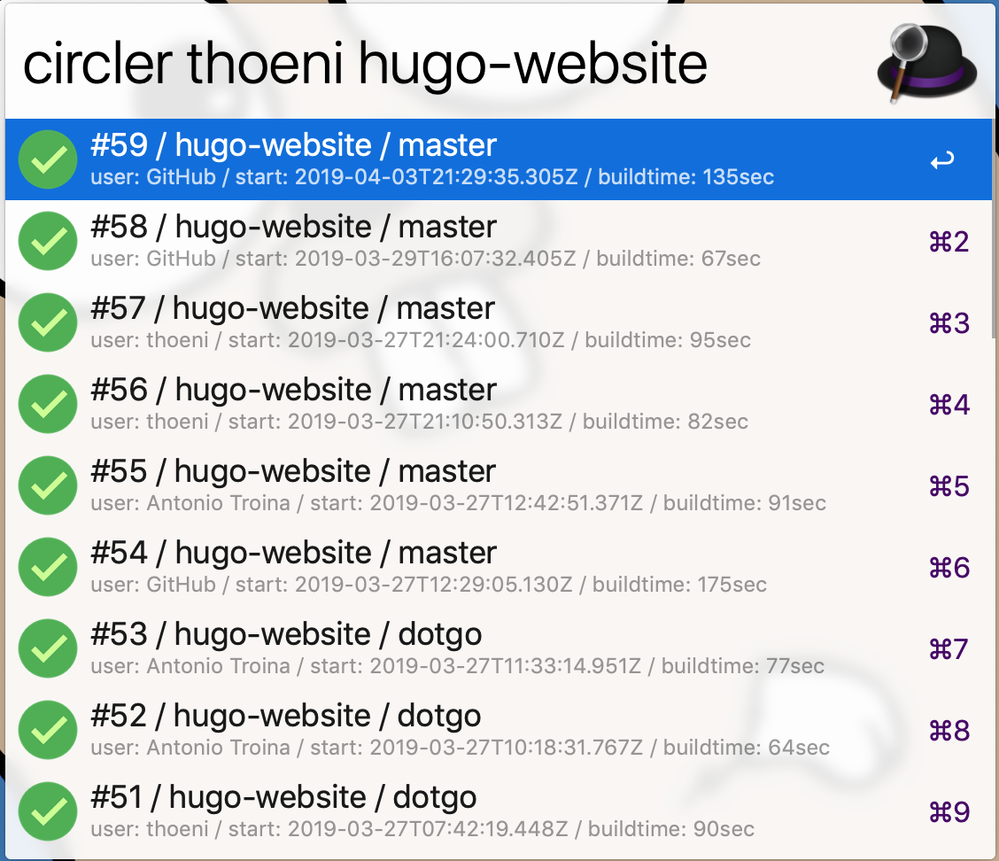
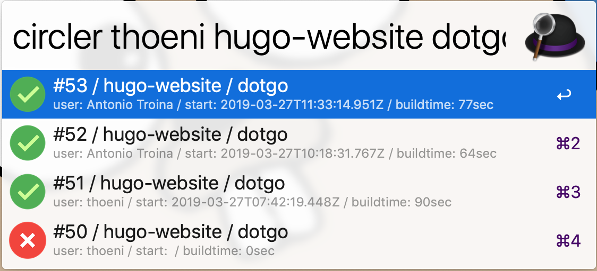
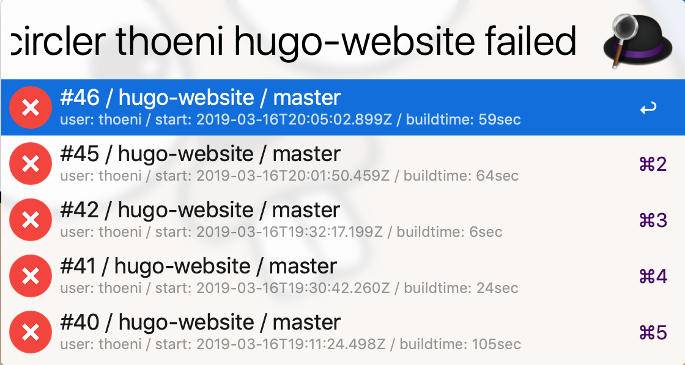

# Alfred CircleCI Workflow

Show CircleCI Build Status.







## Install

Download and double-click.

- https://github.com/thoeni/alfred-circleci-workflow/releases/latest

## Usage

Register CircleCI Token.

- `apikey` saved in your `Keychain Access.app`

```
circleci token <XXXX>
```

Search and show build status.

* `circlef`: CircleCI find/filter, search by default amongst the last 30 builds, and applies the filter if provided.

	Example:
   - `circlef`
   - `circlef master`

* `circler`: CircleCI repo, search the given username and repo pair, by default amongst the last 30 builds for that repo, and applies the filter if provided.

	Example:
	- `circler thoeni alfred-circleci-workflow`
	- `circler thoeni alfred-circleci-workflow master`